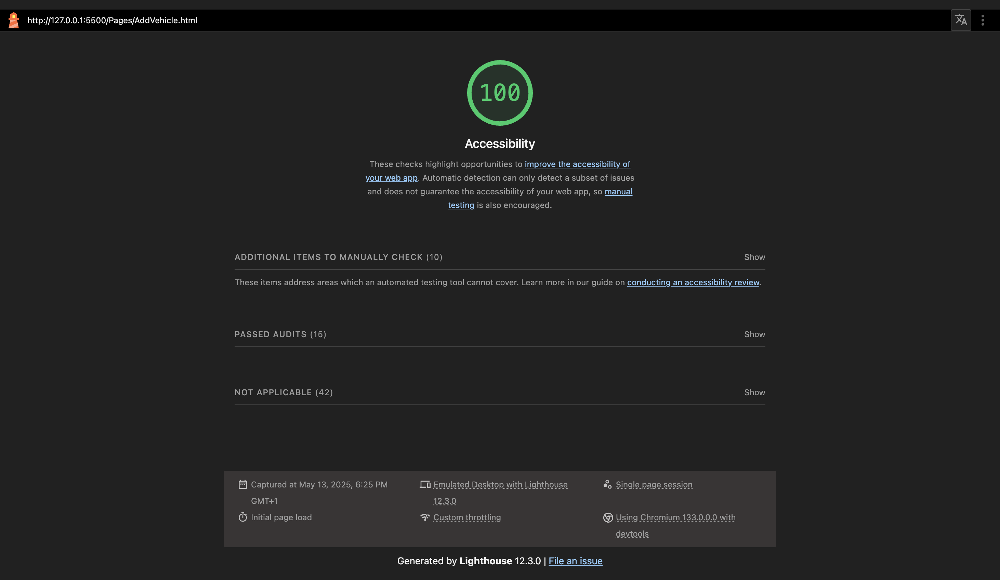
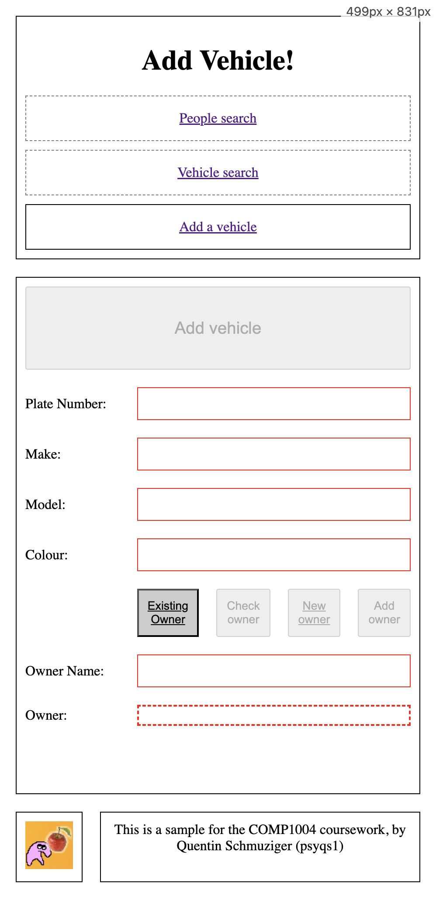
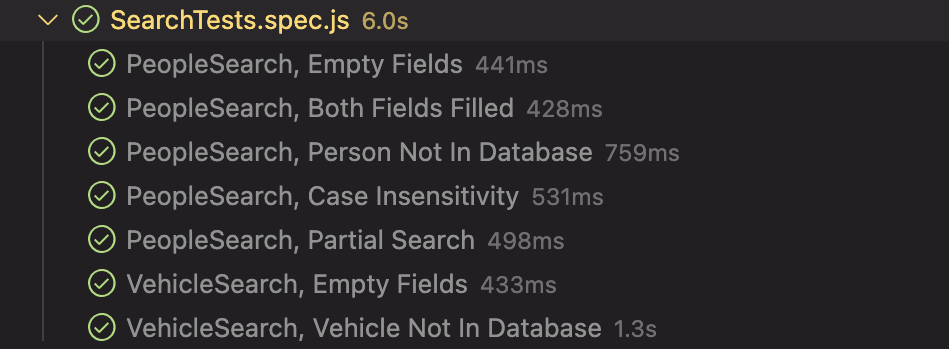
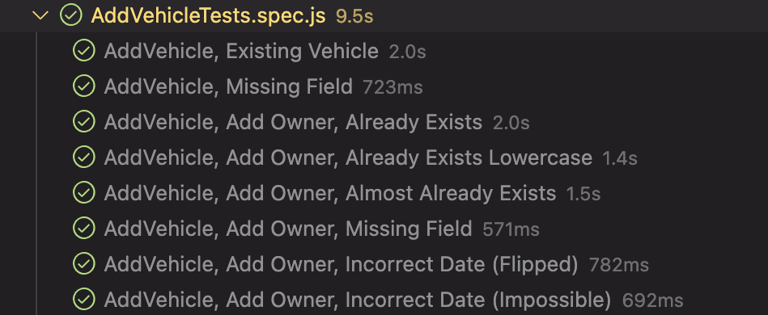
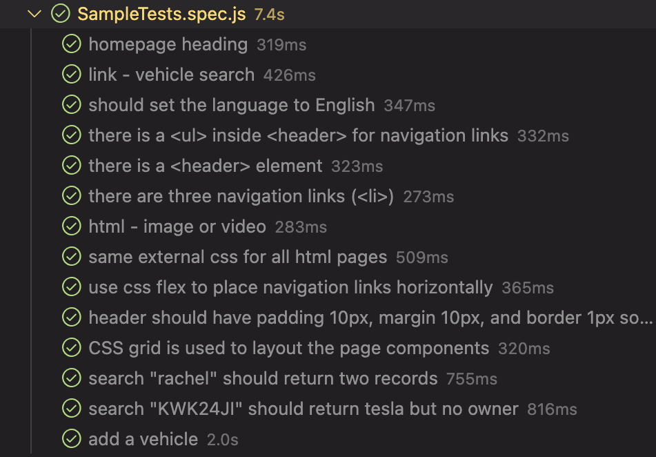

# Additional Work Report

## HTML

### Add Vehicle Page - 100% Accessibility

#### Accessibility Element Examples:
1. Buttons have an accessible name. - See [AddVehicle.html:45](./Pages/AddVehicle.html) for example.
2. Image elements have alt text and it is not redundant. - See [AddVehicle.html:26](./Pages/AddVehicle.html)
3. Document has a title element - See [AddVehicle.html:10](./Pages/AddVehicle.html)
4. Html element has a (valid) lang attribute - See [AddVehicle.html:2](./Pages/AddVehicle.html#)
5. Form elements have associated labels - See [AddVehicle.html:31](./Pages/AddVehicle.html#)
6. Links have a discernible name - See [AddVehicle.html:19](./Pages/AddVehicle.html#)
7. Lists contain only li elements, and list items are contained within ul, ol or menu parent elements - See [AddVehicle.html:19](./Pages/AddVehicle.html#)
8. Touch targets have sufficient size and spacing. - See [Style.css:96](./Style/Style.css#)
    - Padding ensures the touch targets have enough size. This was especially important on text input fields as they're quite narrow.
9. Heading elements appear in a sequentially-descending order - See [AddVehicle.html:16](./Pages/AddVehicle.html#)
10. HTML5 landmark elements are used to improve navigation - See [AddVehicle.html:15](./Pages/AddVehicle.html#)

Additionally, I manually tested the following:

11. **Interactive controls are keyboard focusable** - Tested by tabbing through the form elements. It is possible to fill and submit the form using only the keyboard.
12. **Interactive elements indicate their purpose and state** - The form communicates fields that must be filled in. Highlighting them when they are yet to be filled or filled incorrectly. It is clear they are interactable.
13. **The page has a logical tab order** - Tabbing through the page goes from top to bottom.
14. **Visual order on the page follows DOM order.**
15. **User focus is not ever accidentally trapped in a region.**
16. **The user's focus is directed to new content added to the page** - Page is small enough that there is no need to move focus.
17. **Offscreen content is hidden from assistive technology** - There is no offscreen content.
18. **Custom controls have associated labels & Custom controls have ARIA roles** - There are no custom controls.

## CSS

### Mobile Layout (<500px)

#### Achieved using Media Queries at the following locations in [Style.css](./Style/Style.css):
1. Site Layout
    - Location: Line 4 to Line 16
    - Description: Changes the grid layout of the site depending on platform.
2. Navbar direction
    - Location: Line 35 to Line 40
    - Description: Changes the navigation links to be listed either horizontally or vertically depending on platform. 
3. Add Vehicle Form Layout
    - Location: Line 76 to Line 83
    - Description: Changes how the form is laid out slightly depending on platform.
4. Add Vehicle Form, Submit Button 
    - Location: Line 135 to Line 140
    - Description: Changes submit button to take up most of horizontal space on mobile, for better usability.
5. People/Vehicle Search Form Layout:
    - Location: Line 114 to Line 119
    - Description: Changes how the form is laid out slightly depending on platform.
6. People/Vehicle Search Form, Submit Button
    - Location: Line 122 to Line 128
    - Description: Changes submit button to take up most of horizontal space on mobile, for better usability.

## JS (Tests)

### People Search Tests

-   Searching With Empty Fields - See [SearchTests.spec.js:13](./Tests/SearchTests.spec.js)
    - Goal: Since there is nothing to search against, the website should not let the user perform a search with empty fields.
-   Searching With Both Fields Filled - See [SearchTests.spec.js:24](./Tests/SearchTests.spec.js)
    - Goal: As per the spec, the website should not let the user perform a search with both the name and license number. If the user manages this, an error message should be displayed.
-   Searching For a Person Not In Database - See [SearchTests.spec.js:36](./Tests/SearchTests.spec.js)
    - Goal: Since there is nothing to display, the website should inform the user no results were found.
-   Ensuring Fields are Case Insensitive - See [SearchTests.spec.js:47](./Tests/SearchTests.spec.js)
    - Goal: For ease of use, the website should allow searches for (example) 'john' to retrieve 'John'. 
-   Ensuring Partial Search Works as Expected - See [SearchTests.spec.js:68](./Tests/SearchTests.spec.js)
    - Goal: For ease of use, the website should allow searches for (example) 'Joh' to retrieve 'John'.

### Vehicle Search Tests

-   Searching With Empty Field - See [SearchTests.spec.js:92](./Tests/SearchTests.spec.js)
    - Goal: Since there is nothing to search against, the website should not let the user perform a search with an empty field.
-   Searching For a Vehicle Not In Database - See [SearchTests.spec.js:102](./Tests/SearchTests.spec.js)
    - Goal: Since there is nothing to display, the website should inform the user no results were found.
-   Ensuring Search Returns All Details - See [SearchTests.spec.js:113](./Tests/SearchTests.spec.js)
    - Goal: The website should return every required detail from a search. (Vehicle ID, Make, Model, Colour, and Owner)
-   Ensuring Search Handles Missing Owner - See [SearchTests.spec.js:127](./Tests/SearchTests.spec.js)
    - Goal: The website should be able to handle vehicles with a missing owner safely. 

### Add Vehicle Tests

-   Trying to Add Existing Vehicle - See [AddVehicleTests.spec.js:11](./Tests/AddVehicleTests.spec.js)
    - Goal: To avoid duplicate entries in the database, the website should not insert vehicles that already exist and should instead inform the user about its pre-existance.
-   Trying to Add Vehicle with a Missing Field - See [AddVehicleTests.spec.js:30](./Tests/AddVehicleTests.spec.js)
    - Goal: To avoid incomplete entries in the database, the website should not insert vehicles if every detail isn't filled out. 

### Add Owner Tests

-   Trying to Add Existing Owner - See [AddVehicleTests.spec.js:49](./Tests/AddVehicleTests.spec.js)
    - Goal: To avoid duplicate entries in the database, the website should not insert owners that already exist and should instead set the owner of a new vehicle to be that existing owner.
-   Trying to Add Existing Owner, but Using Lowercased Name - See [AddVehicleTests.spec.js:82](./Tests/AddVehicleTests.spec.js)
    - Goal: The website should ensure a new owner named 'john x' cannot be added if a 'John x' already exists, they represent the same person.
-   Trying to Add Owner, Whose Information *Almost* Matches an Existing Owner - See [AddVehicleTests.spec.js:115](./Tests/AddVehicleTests.spec.js)
    - Goal: The website should ensure adding an owner with (example) the same name but different license number to an existing owner *is* permitted.  
-   Trying to Add Owner with a Missing Field - See [AddVehicleTests.spec.js:149](./Tests/AddVehicleTests.spec.js)
    - Goal: To avoid incomplete entries in the database, the website should not insert owners if every detail isn't filled out. 
-   Trying To Add Owner with a DD-MM-YYYY Date Instead of the Correct YYYY-MM-DD - See [AddVehicleTests.spec.js:173](./Tests/AddVehicleTests.spec.js)
    - Goal: Enforcing a date format
-   Trying To Add Owner with an Impossible Date - See [AddVehicleTests.spec.js:192](./Tests/AddVehicleTests.spec.js)
    - Goal: Enforcing a date format

### Sample Tests

