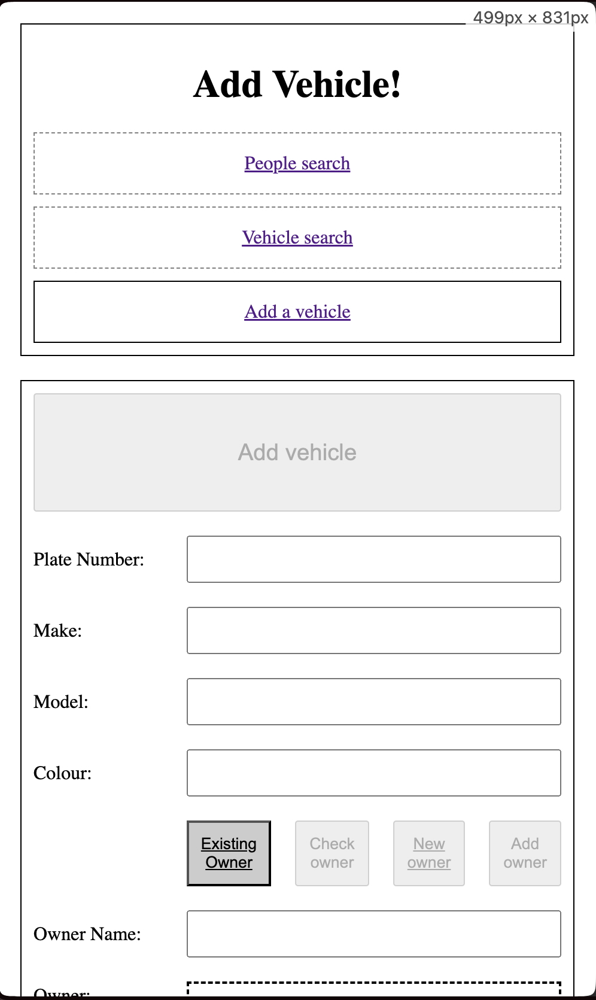
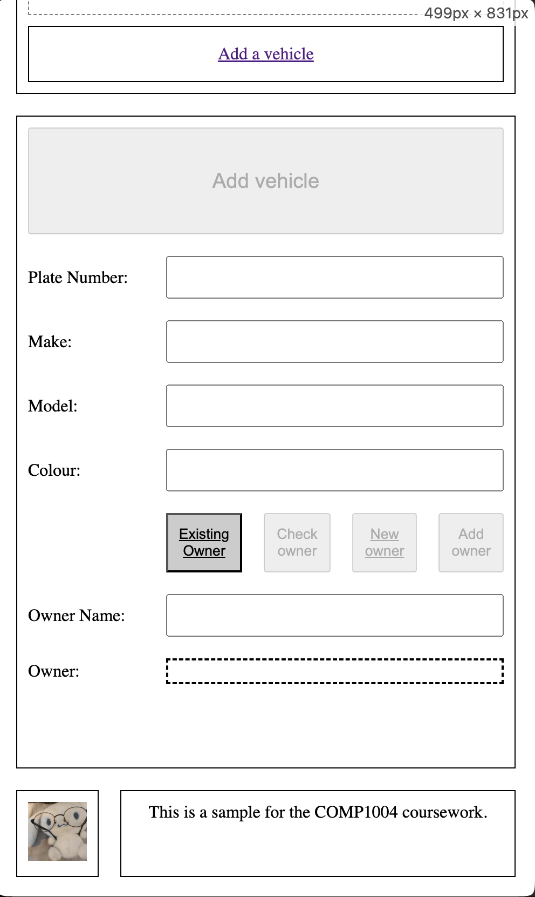

# Additional Work Report

## HTML

### Add Vehicle Page - 100% Accessibility

#### Accessibility Element Examples:
1. Buttons have an accessible name. - See [AddVehicle.html:45](./Pages/AddVehicle.html) for example.
2. Image elements have alt text and it is not redundant. - See [AddVehicle.html:26](./Pages/AddVehicle.html)
3. Document has a title element - See [AddVehicle.html:10](./Pages/AddVehicle.html)
4. Html element has a (valid) lang attribute - See [AddVehicle.html:2](./Pages/AddVehicle.html#)
5. Form elements have associated labels - See [AddVehicle.html:31](./Pages/AddVehicle.html#)
6. Links have a discernible name - See [AddVehicle.html:19](./Pages/AddVehicle.html#)
7. Lists contain only li elements, and list items are contained within ul, ol or menu parent elements - See [AddVehicle.html:19](./Pages/AddVehicle.html#)
8. Touch targets have sufficient size and spacing. - See [Style.css:96](./Style/Style.css#)
    - Padding ensures the touch targets have enough size. This was especially important on text input fields as they're quite narrow.
9. Heading elements appear in a sequentially-descending order - See [AddVehicle.html:16](./Pages/AddVehicle.html#)
10. HTML5 landmark elements are used to improve navigation - See [AddVehicle.html:15](./Pages/AddVehicle.html#)

## CSS

### Mobile Layout (<500px)

#### Achieved using Media Queries at the following locations in [Style.css](./Style/Style.css):
1. Site Layout - Line 4, Line 11
2. Navbar direction - Line 35, Line 38
3. Add Vehicle Form 
    - Layout - Line 76, Line 80
    - Add Vehicle Button - Line 131, Line 134
4. People/Vehicle Search Form Layout:
    - Text Input Field - Line 110, Line 113
    - Search Button - Line 119, Line 122

## JS